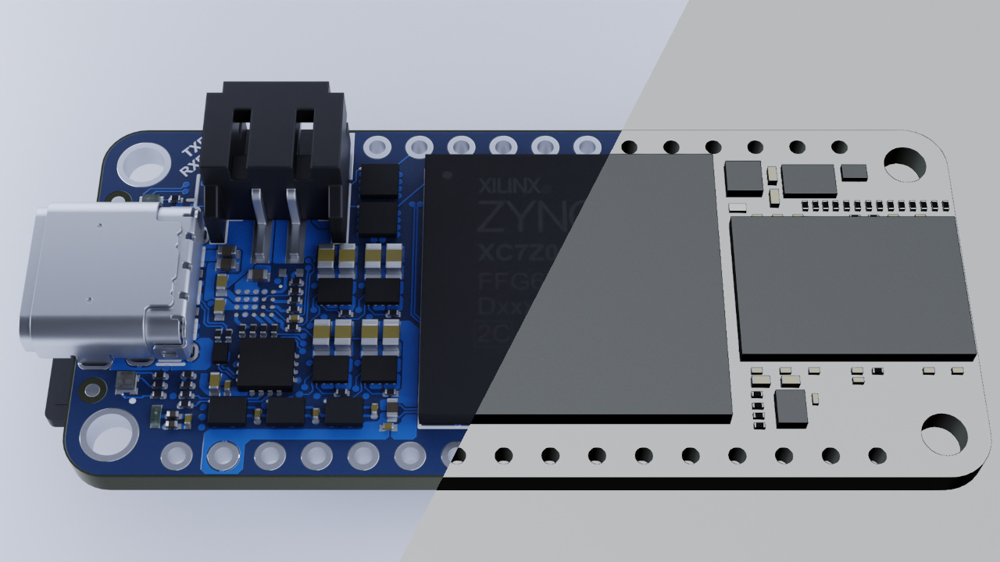
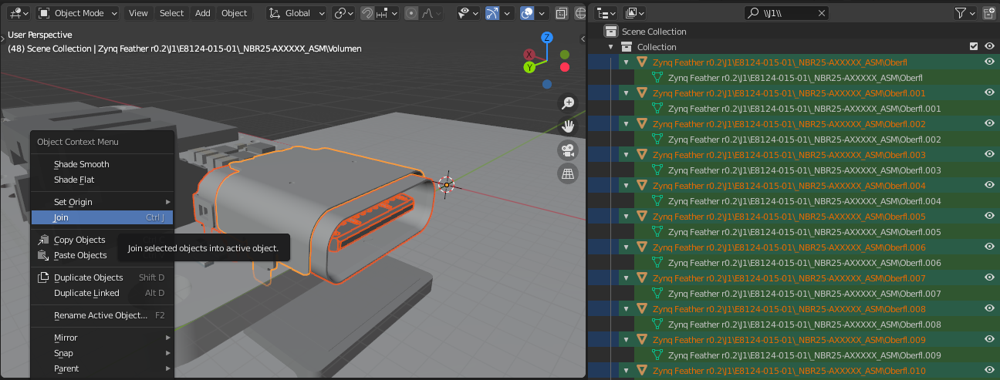
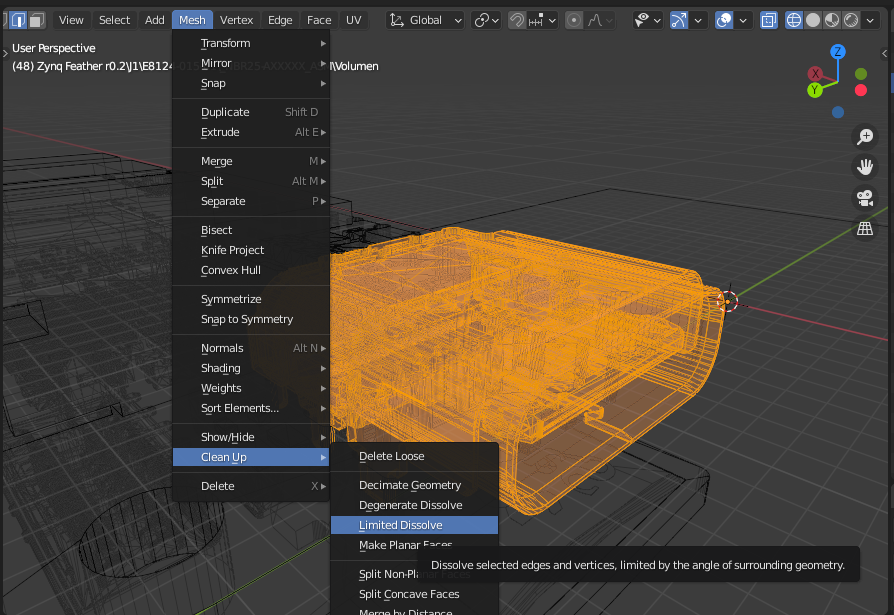
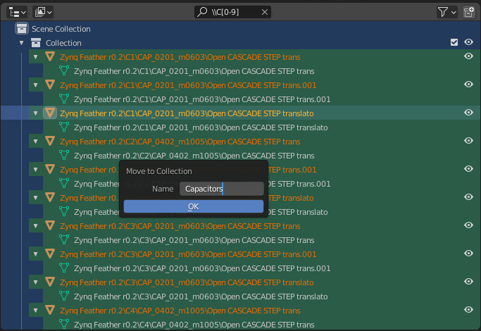
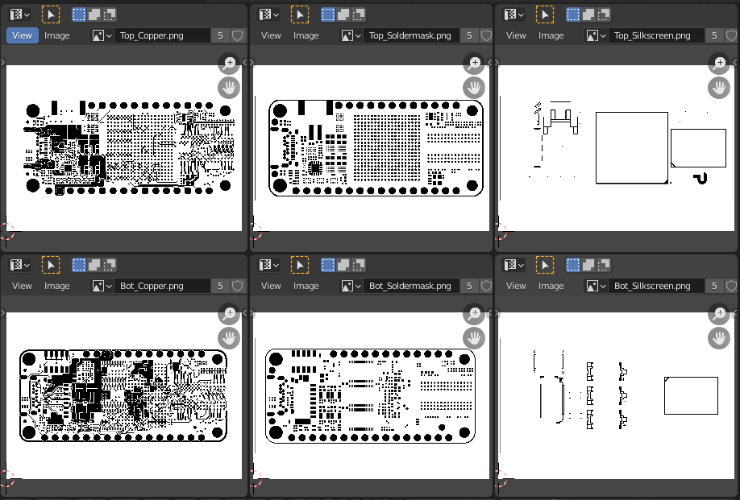
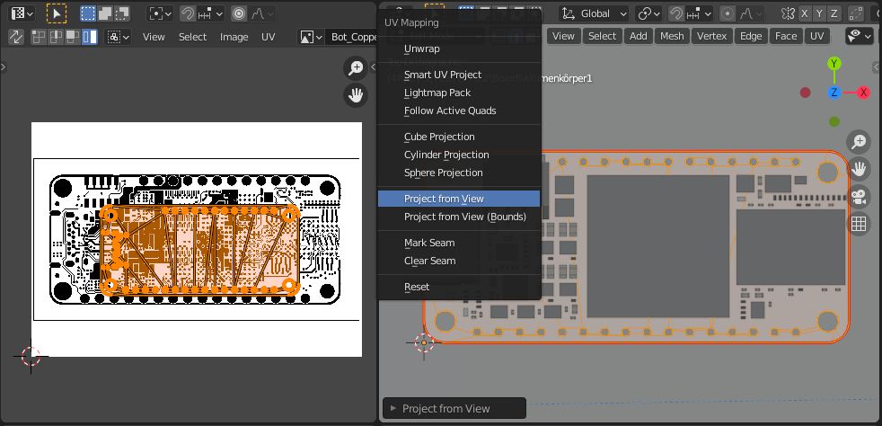
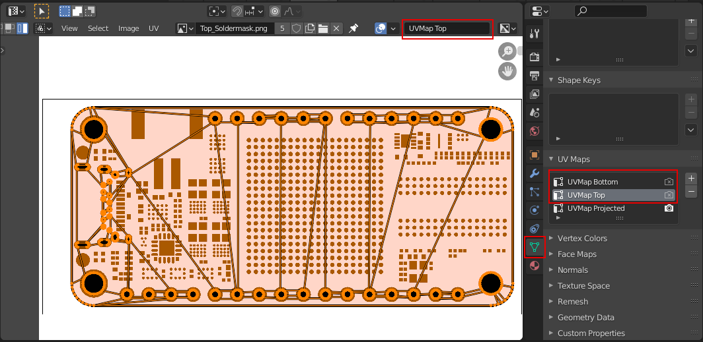

# Rendering PCBs (Part 1) — Preparation, Textures and UV Unwrapping

*Published: 4 March 2021*  
*Tags: Tutorial, Blender, PCB, 3D*  
*Author: Florian Winkler*

In this tutorial series we explain how to create realistic renders from 3D models of PCBs in Blender. This first part covers preparing the 3D objects, gathering the required textures, and UV unwrapping.

On GitHub we provide a sample project. There you can download the [blender file](https://github.com/PCB-Arts/stylized-blender-setup/releases/download/v1.1/stylized-blender-setup-v1.1.zip), which contains a complete setup with models, corresponding textures, and shader settings.

## Preparation

The most important thing is the 3D model of the PCB. Additionally, the components placed on it can also be imported; these will only be considered in part 3. To import the models into Blender, first export the board from the CAD program in which it was designed. This depends on which program you are using. In our case we exported `.step` files from Altium and converted them to an `.obj` file and associated `.mtl` file using the free tool DesignSpark Mechanical.

After importing the 3D objects into Blender, it’s recommended to clean things up: simplify the geometry of the objects, merge objects that belong together, and group components using collections. This makes it easier to work with the objects and also improves Blender’s performance. These steps are explained in more detail below.

### Merging Objects (Join)

Sometimes single components consist of many small pieces. An example is the USB‑C connector shown in the screenshot, which consists of about 1000 objects.

To simplify this complex geometry, merge all individual pieces into one object. Instead of tediously selecting all the individual parts, use the search function in the **Outliner**. In the screenshot the identifier `J1` was used; therefore all objects that belong to the component J1 are shown in the **Outliner**. Select all filtered objects using `A` and join them using `Ctrl` + `J` in the **Viewport**. Make sure one object is highlighted in yellow.

### Simplifying the Geometry (Limited Dissolve)

Blender provides a convenient method to simplify meshes using **Limited Dissolve**. The detailed USB‑C connector can serve as an example again. It has 31,824 faces after joining all pieces together and is thus quite complex!

In the **Viewport**, access **Limited Dissolve** via the menu `Mesh > Clean Up > Limited Dissolve`. After the simplification, the USB‑C connector has only 6,639 faces—the geometric complexity is reduced significantly (by 79%).

Using **Limited Dissolve** is also beneficial for the board, which can have quite a lot of edges and faces due to holes or vias. For small components or ICs, this method usually does not bring notable improvements.

### Grouping Objects in Collections (Move to Collection)

This step is optional and serves to organize the objects in the **Outliner**. Similar to merging objects, it’s recommended to search for components by their identifier. For example, in the screenshot we filtered for capacitors using the search pattern `\\C[0-9]` (meaning the name of the object should have a `C` after the backslash followed by a number between 0 and 9).

After entering a suitable search pattern, select all filtered objects with `A` and open the **Move to Collection** menu with `M`. Decide whether the selected objects should be moved to an existing or a new collection. In the example shown here, a new collection is created with the name **Capacitors**.

## Textures

Different textures are needed to render traces or the solder mask on the 3D model of the PCB. These textures are black‑and‑white images generated by the CAD program. The following images are needed:

- Copper Layer
- Silkscreen Layer
- Soldermask Layer

If both sides should be taken into account, different textures are needed for top and bottom. In this case, you need six textures for the board.

In our example project, we chose a resolution of about 4600 × 3300 pixels (be generous here) for the PCB textures. The export of the images may vary depending on the CAD software. If the CAD program does not allow a direct export of PNG images, one possible solution is to export the layers as vector graphics or PDF and then open them in GIMP. There the image can be cropped and saved as a PNG image.

In Blender, image files can be opened in the **UV Editor**. Three or six textures should now be present (see screenshot).

## UV Unwrapping

In UV unwrapping, two‑dimensional textures are assigned to the faces of a three‑dimensional object. To project the textures onto the surface, use **Project from View**. Before unwrapping, make sure the viewport has the top perspective. `Numpad 7` switches to this perspective. In **Edit Mode** open the **UV Mapping** menu using `U` and execute **Project from View**.

After unwrapping, you can see the projected geometry of the board in the **UV Editor** (left in the screenshot above). This now needs to be aligned with the textures. When aligning, make sure that all surfaces are selected (orange) both in the viewport and in the **UV Editor** so that everything is scaled and moved evenly. The holes and the outline of the board are useful for alignment.

It can happen that bottom and top layers are misaligned. If this is the case, two different UV Maps are required for the board object. UV Maps can be managed in **Properties** under `Object Data > UV Maps` and can be swapped in the **UV Editor** (see red boxes in the screenshot).

## Summary

The 3D models and the textures are now prepared for the subsequent steps. In the next part, we will look at the configuration of the board’s shader. Based on the textures, the shader decides where copper, solder mask, or silkscreen are visible and how these different materials should be rendered.

**Next part:** [Rendering PCBs (Part 2) — Shader Setup](part-2.md)
