# Rendering PCBs (Part 2) — Shader Setup

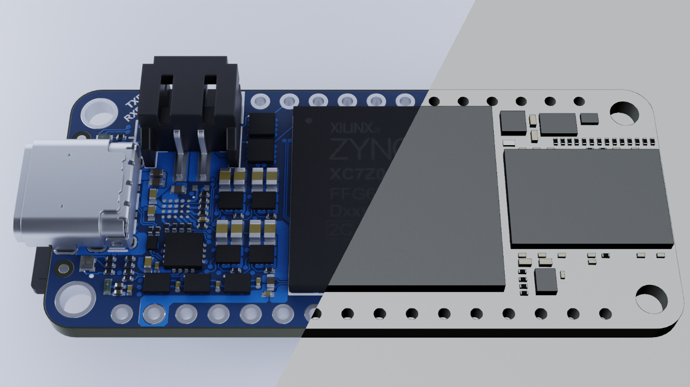

*Published: 27 March 2021*  
*Tags: Tutorial, Blender, PCB, 3D*  
*Author: Florian Winkler*

The next step is to create a shader for the board. Based on the textures previously set up, this decides where copper, soldermask, or silkscreen should be visible and how these different materials should be rendered.

On GitHub we provide a sample project. There you can download the [blender file](https://github.com/PCB-Arts/stylized-blender-setup/releases/), which contains a complete setup with models, corresponding textures, and shader settings.

## Integrating textures

Open the **Shader Editor** to edit the board material. Add the previously imported textures to the board’s shader. The textures contain information about where soldermask, silkscreen, or copper should be visible. All requirements for this were described in [part 1](/en/blog/blender-tutorial-1).

A challenge is to combine the textures so that the top-layer textures are only applied to the top and the bottom-layer textures only to the bottom. Geometry information of the mesh can be used for this distinction. The **Texture Coordinate** node provides the necessary vector information at the **Generated** output. These vectors contain values between 0.0 and 1.0 within the bounding box of the body. Considering only the Z coordinate, a decider can be built using a **Less Than** node. This returns 0 if the Z coordinate is greater than or equal to 0.5 (top to center of the mesh), and 1 from the center to the bottom.

This decider serves as the **Factor** of a **Mix** node, which combines the top and bottom textures. Keep in mind the textures may require different UV maps. The screenshot shows the arrangement of the shader nodes and how the black‑and‑white textures are mapped onto the 3D body.

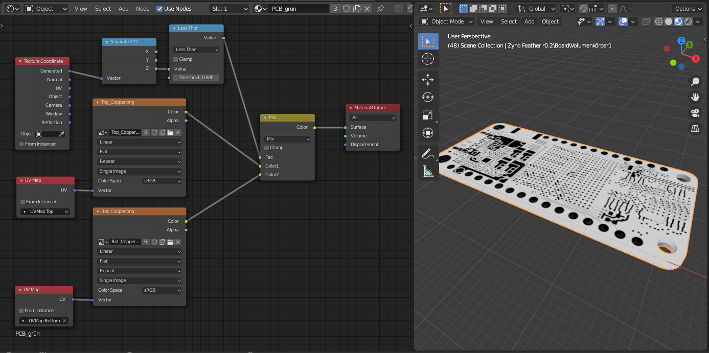

Repeat this mixing for the other two texture pairs in the same way. Finally, the **Mix** nodes produce three outputs, which are needed for the further decision logic. It is recommended to group these nodes. The final setup of the layer masks is shown below.

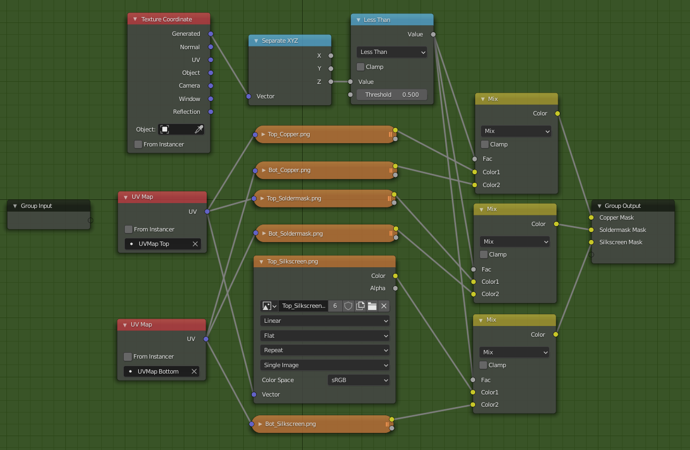

## Materials

A circuit board is made up of various materials. In Blender, almost any material can be represented using the **Principled BSDF** shader. This shader has a variety of parameters that need to be set accordingly. The values described here are recommendations from trial and error; adjust to taste. For a deeper dive, Blender Guru’s video, *How to make Photorealistic Materials in Blender, using the Principled Shader*, is extremely helpful.

### Silkscreen

The silkscreen material is the easiest. Its **Base Color** is almost always white (`#FFFFFF`). Only the **Roughness** parameter needs an adjustment.

**Principled BSDF parameters:**

- Roughness: `0.9`

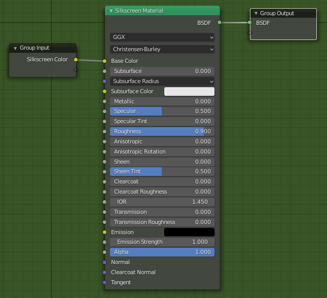

### Soldermask

The soldermask material is slightly transparent, so it appears brighter where copper lies underneath. To capture this, manipulate **Base Color** using the copper mask—combine two colors (e.g., a light and a dark blue) with a **Mix** node (see below).

Because the material is lacquer‑like, you can also use **Clearcoat** parameters to achieve realistic highlights.

**Principled BSDF parameters:**

- Base Color: `#116CC2` and `#053059` (blue soldermask)
- Roughness: `0.6`
- Clearcoat: `0.4`
- Clearcoat Roughness: `0.15`

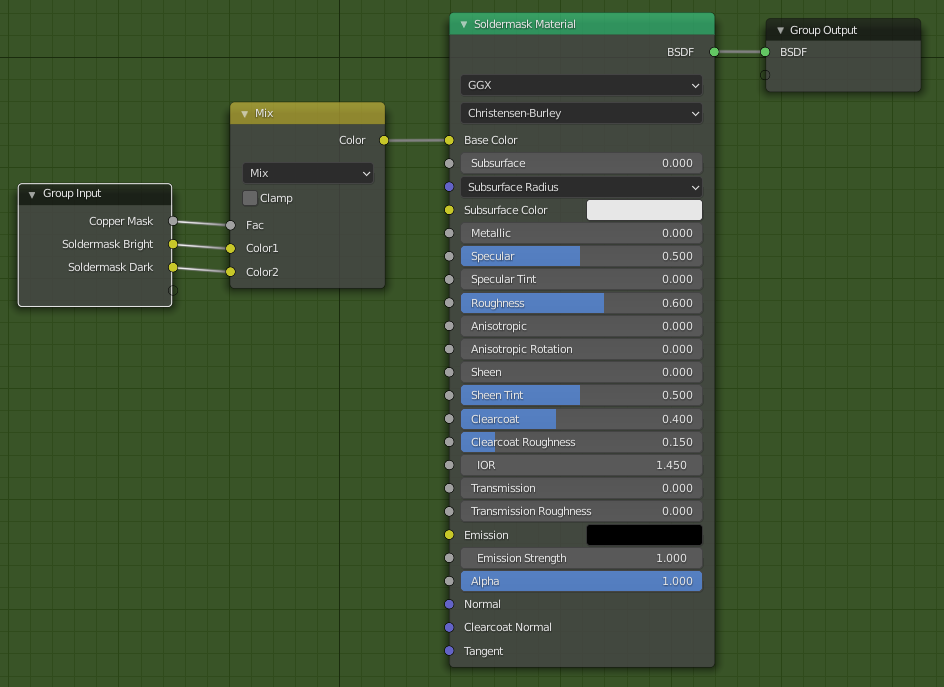

### Copper

Copper here refers to the exposed pads of the PCB. It’s metallic and typically appears silver‑ish or gold‑ish depending on surface finish.

**Roughness** controls the surface character. A value of `0.0` yields a mirror‑like metal—unrealistic for PCBs. Due to impurities or oxidation, more diffuse reflections look better; `0.4` worked well for us.

**Principled BSDF parameters:**

- Base Color: `#FFDF7F` (gold‑ish) or `#E9ECF2` (silver‑ish)
- Metallic: `1.0`
- Roughness: `0.4`
- Specular Tint: `1.0`

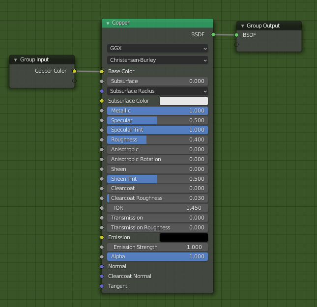

### Base material

The PCB base material (substrate) is mostly visible on edges and through cutouts. It’s a fiberglass composite and slightly transparent, so increase **Transmission**.

The substrate has a layered structure, which you can mimic with a **Checker Texture** alternating two desaturated browns in the Z direction. Configure the **Checker Texture** as shown.

**Principled BSDF parameters:**

- Roughness: `0.8`
- Transmission: `0.3`

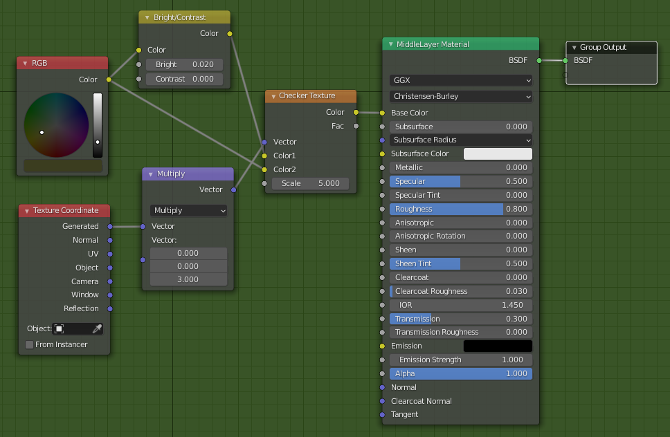

## Decision logic

Now that all materials are set up, combine them using logic driven by the black‑and‑white layer masks (copper, soldermask, silkscreen). We assume:

- **Copper mask:** white → *no copper*, black → *copper*.
- **Silkscreen mask:** white → *no silkscreen*, black → *silkscreen*.
- **Soldermask mask:** white → *soldermask*, black → *no soldermask*.

### Combining materials

Layers are added to the base material in a specific order, forming a hierarchy:

1. **Base & copper** at the bottom. Use the copper mask to decide where copper is visible; otherwise select the base material.
2. **Soldermask** above that. Where soldermask exists, neither copper nor base should be visible. Exception: soldermask only exists on the top or bottom—holes and the middle layer expose copper or base (handled by 2*).
3. **Silkscreen** on top, “overwriting” everything beneath. The silkscreen mask decides where it appears.

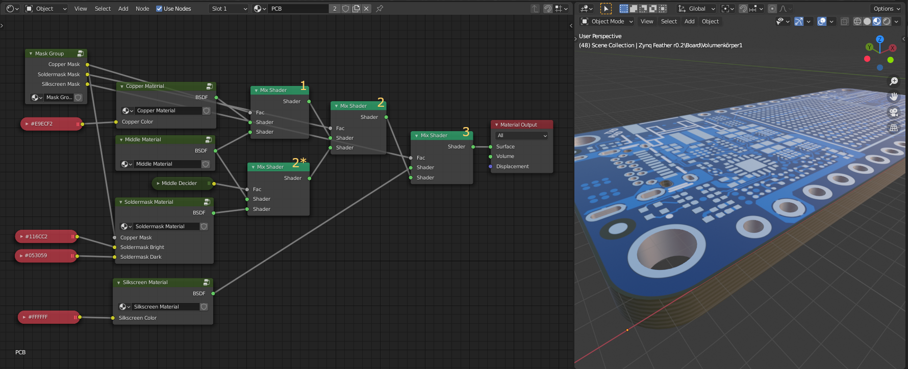

When combining the soldermask and base material, another decider ("Middle Decider") is used. It returns `1` for the top or bottom layer and `0` in between. Using a **ColorRamp** with the Z coordinate from **Texture Coordinate**, generate a mask where black is `0` and white is `1`.

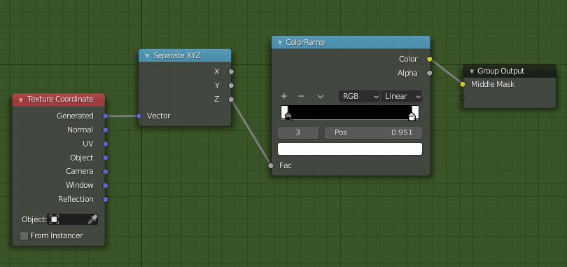

### Calculating Displacement

Displacement can deform the surface to show height differences between layers. Weight each layer mask with a coefficient and sum them—conveniently as a dot product of two vectors in the **Shader Editor** (see below). The resulting scalar is the displacement magnitude.

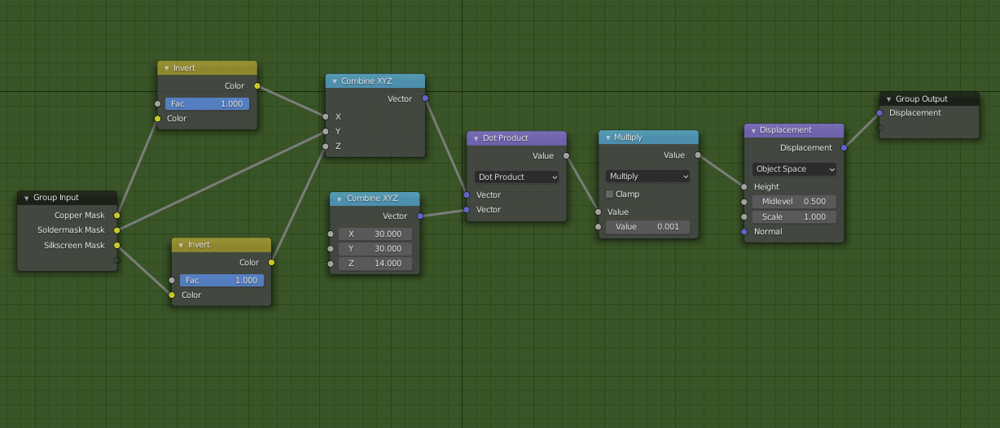

The second vector contains the weights `30`, `30`, and `14`. Scale the dot product by `0.001` with a **Multiply** node so the deformation isn’t too strong.

```txt
Displacement = 0.001 * (30 * CopperMask + 30 * SoldermaskMask + 14 * SilkscreenMask)
```

When calculating displacement, invert the copper and silkscreen masks so the contributions add correctly.

## Final setup

Once everything is connected, the board shader should look something like this:

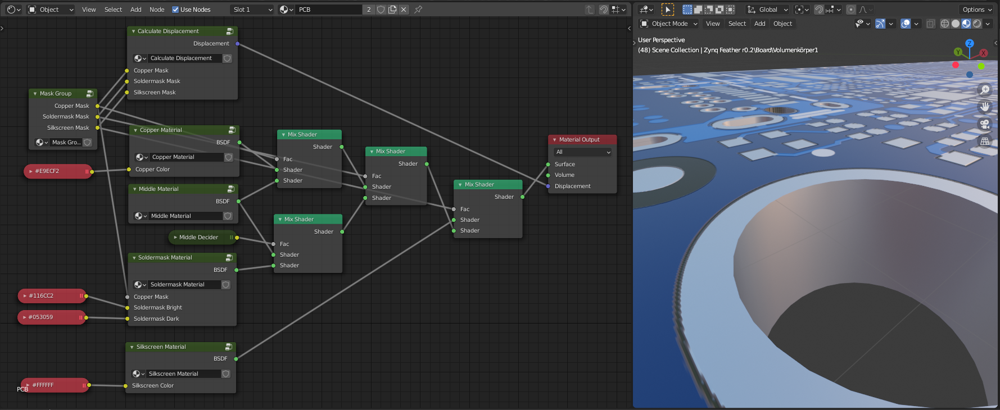

## Summary

The 3D model of the board now uses a complex shader able to mix different materials so they appear where specified by the layer masks. Displacement has been added to show height differences across layers.

**Next part:** [Rendering PCBs (Part 3) — Final steps](part-3.md)
