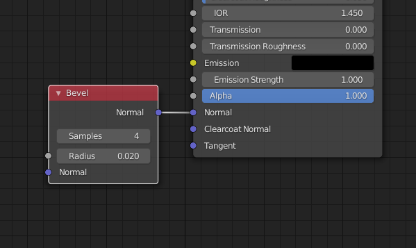
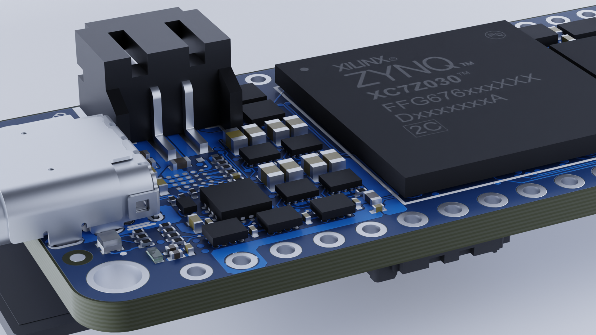
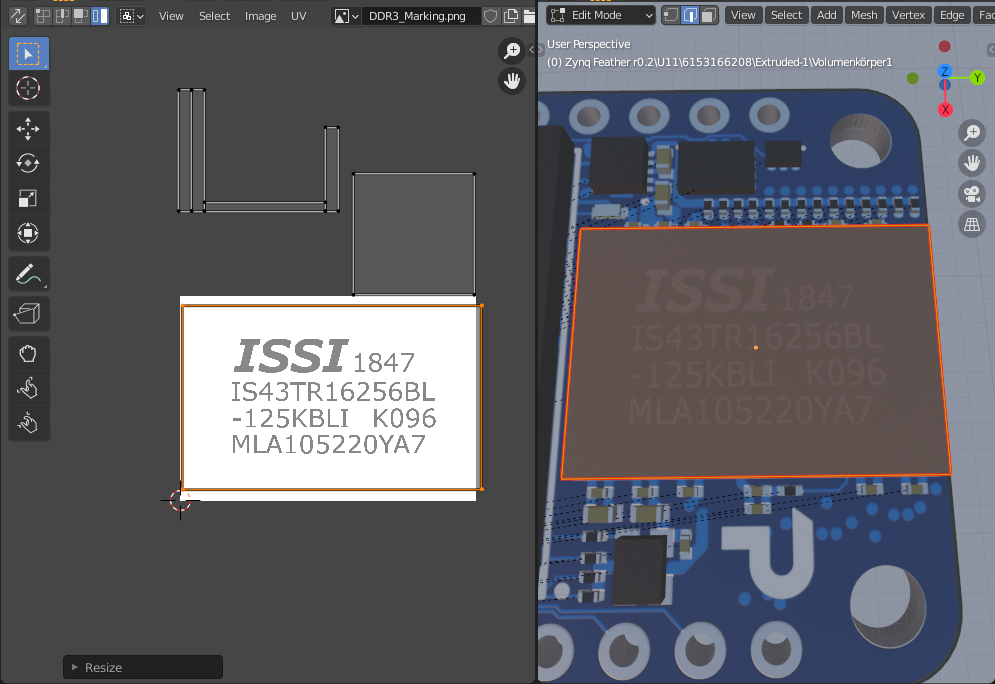
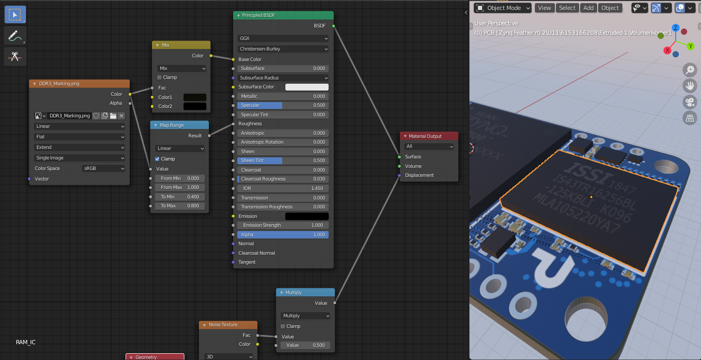
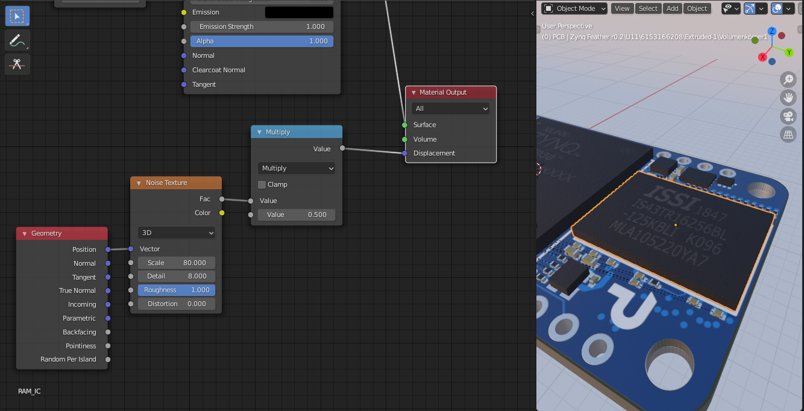
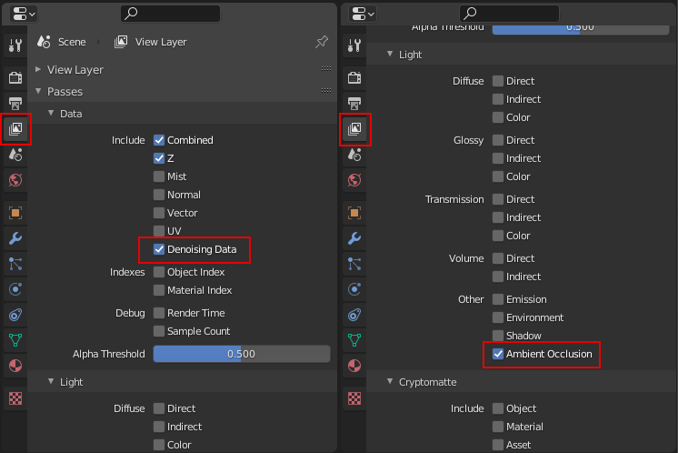
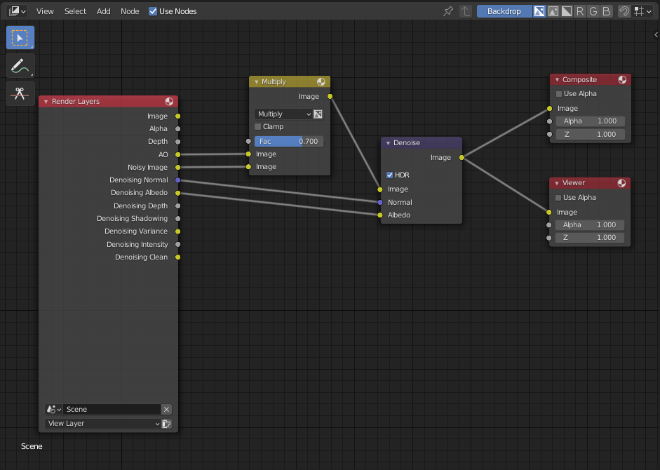

# Rendering PCBs (Part 3) — Final steps

*Published: 19 October 2021*  
*Tags: Tutorial, Blender, PCB, 3D*  
*Author: Florian Winkler*

In this tutorial series we explain how to create realistic renders from 3D models of PCBs in Blender. In the last part of the series, we’ll look at several finishing steps that lead to better render results.

On GitHub we provide a sample project. There you can download the [blender file](https://github.com/PCB-Arts/stylized-blender-setup/releases/download/v1.1/stylized-blender-setup-v1.1.zip), which contains a complete setup with models, corresponding textures, and shader settings.

## Bevel

Most SMD components have very simple geometry: straight boxes. Due to the perfect shape, renders often look unrealistic. For example, the JST connector of the Zynq‑Feather has many sharp edges. In reality, the edges of connectors, IC packages, or SMD components are more or less rounded because of manufacturing tolerances.

With a **Bevel** node, rounded corners can be added to a material without changing object geometry. Connect the node to the **Normal** input of a **Shader** node. Use **Radius** to set the curvature. Small **Radius** values suit IC packages (sharper corners); larger values suit rounded solder contacts like those on SMD resistors. The following figure shows a typical setup in the **Shader Editor**.

At first glance, the difference is subtle. For comparison, here are two renders—one without bevel and one with bevel:

**Before (unbeveled):**  

**After (beveled):**  

Using Bevel nodes was suggested by one of our Twitter followers. They mention it in this video: <https://www.youtube.com/watch?v=7ratnf0rIVU>.

## Labels

IC packages often have a label showing a product number, manufacturer name, or similar. To implement such a label in Blender, create a texture containing the labeling as a black‑and‑white image. Labels are often shown in component data sheets; you can extract them from the PDF as a screenshot or using an image editor. Then set up a **UV Map** to project the texture onto the top of the IC package. Place all other faces outside the image. To ensure the label isn’t present on other faces, set the **Extension** attribute of the **Image Texture** node to **Extended** (default is **Repeat**).

For the Zynq‑Feather example a label is added to a RAM IC. The following screenshot shows the **UV Map** configuration.

After the UV map is set up, adjust the component’s material. Since ICs are often assigned the same materials during export, first make a copy of the material so changes apply only to the selected part.

In manufacturing, IC markings are often applied to the package surface by laser. The lettering is slightly brighter than the otherwise black package and less rough. Account for this by driving **Base Color** and **Roughness** with the label texture. For **Base Color**, use a **Mix** node to mix the black case color with a dark‑brown marking color. Control **Roughness** with a **Map Range** node, mapping texture values from `0.0` (black) to `1.0` (white) into `0.4` (rather smooth) to `0.8` (rough). The material settings are summarized below.

For close‑ups, it’s worth adding **Displacement** to the IC material. To create bumps in the surface, use a **Noise Texture**. The necessary nodes are shown here.

## Denoising

Finally, consider the rendered image itself. In **Cycles**, the result can be noisy. Noise decreases with more samples, but render time increases; even with very high samples, noise may remain. Apply denoising to clean it up.

To set up denoising, enable **Denoising Data** in **View Layer Properties → Passes**. Another visual improvement can be achieved with **Ambient Occlusion**, activated in the same place (see screenshot).

Next, apply **Denoising** and **Ambient Occlusion** in the **Compositor** by wiring up the activated render passes. Example settings are shown below.

## Conclusion

The PCB model is now enhanced with extra details: beveled edges for realism, IC labels, and denoising for clean renders. That wraps the series on rendering PCBs in Blender—have fun creating your own renders!
