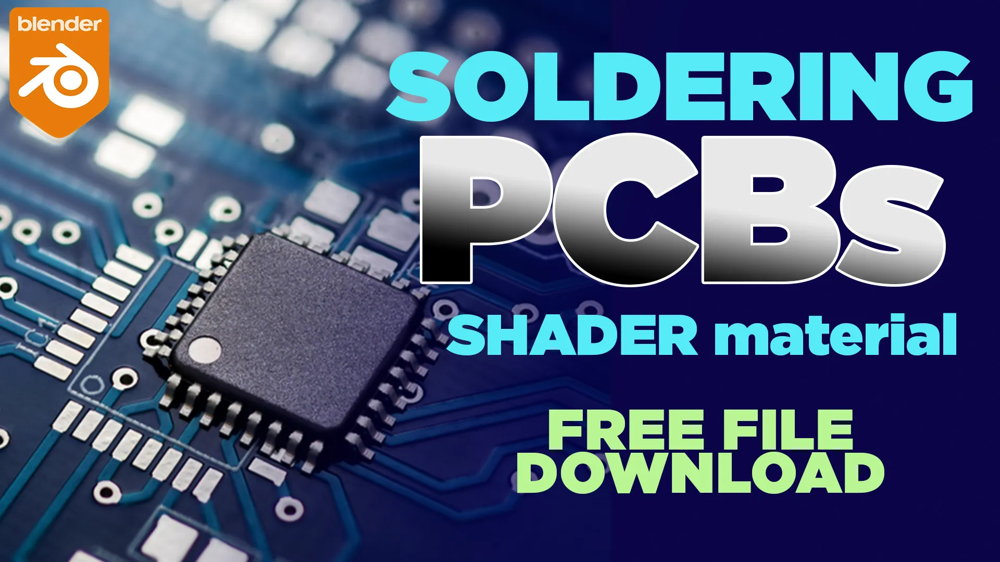

# Advanced Tutorial: Stylized PCB & Soldering Shader in Blender

This guide provides a detailed walkthrough for creating a highly customizable, stylized Printed Circuit Board (PCB) and soldering material in Blender. This shader was originally created by **3dcinetv.com** after being inspired by the incredible work of **@PCBArts**, who was looking for a realistic soldering material.

A key feature of this shader is that it's **light-independent**, meaning its glow and appearance are controlled directly within the material itself, not by the lights in your scene. The creator has made it easy to modify by placing all the main controls within **red-labeled nodes**.

## Project Background

As detailed in an article on 3dcinetv.com, the creator was inspired by the amazing 3D renders of electronic components by PCBArts. In response to their search for a soldering shader, this material was developed using a combination of textures and a matcap material to give artists full control. The goal is to provide a tool that is both powerful and easy to customize.

Let's dive in\! 💻

-----

## 1\. Understanding the Node Setup

Instead of building from scratch, let's analyze the pre-made shader's structure, which you can download for free. The core idea is to combine procedural textures and specific vector data to create a realistic yet stylized look.

The full node tree can look complex, but it's broken down into logical sections. The creator has highlighted the most important nodes for customization in a **red frame**.

**As seen in the video at([https://www.youtube.com/watch?v=7ratnf0rIVU\&t=179s](https://www.google.com/search?q=https://www.youtube.com/watch%3Fv%3D7ratnf0rIVU%26t%3D179s))**, the setup uses geometry and camera data to create a dynamic matcap-like effect that mimics the reflective, irregular surface of solder.

-----

## 2\. Key Controls (The Red Frame)

Once you have the material in your project, locate the red frame in the Shader Editor. Here are the key nodes you'll be working with:

### **Color and Appearance**

* **Principled BSDF:** This is where you set the **Base Color** of the solder. You can change it to gold, copper, silver, or any other metal. You can also adjust the `Metallic` and `Roughness` sliders to fine-tune the material's properties.
* **Matcap Texture (`hotspot.png`):** This texture is essential for the solder's unique, shiny appearance. It maps a specific reflection pattern based on the camera's view angle.

### **Transparency and Blending**

* **ColorRamp:** This is one of the most important controls. It manages the transparency and falloff of the solder where it meets the PCB. By adjusting the black and white stops, you can create a soft, blended edge or a hard, crisp one. This prevents the solder from looking too "perfect" or artificial.

**In the video at([https://www.youtube.com/watch?v=7ratnf0rIVU\&t=235s](https://www.google.com/search?q=https://www.youtube.com/watch%3Fv%3D7ratnf0rIVU%26t%3D235s))**, the creator demonstrates how manipulating this ramp makes the solder look interrupted and more realistic, avoiding a plasticky, CG look.

-----

## 3\. Applying the Material

The shader is designed to work best with organic, blob-like shapes that mimic melted solder. The video recommends using **Metaballs** for this.

1. Add a Metaball (`Shift + A` \> `Metaball`).
2. Duplicate and move them around to form solder joints. They will automatically blend into each other.
3. Apply the "Soldering Material" to the metaballs.

The result is a dynamic, liquid-metal effect that perfectly simulates the appearance of hand-soldered joints on a circuit board.

**The final look, as shown at([https://www.youtube.com/watch?v=7ratnf0rIVU\&t=157s](https://www.google.com/search?q=https://www.youtube.com/watch%3Fv%3D7ratnf0rIVU%26t%3D157s)) in the video**, is a beautiful, iridescent material that captures the complex reflections of real solder.

-----

## 4\. Download the Material

The creator has made this material available for free, with an option for donations. You can get it from Gumroad.

* **Download Link:** [Soldering PCB Material on Gumroad](https://www.google.com/search?q=https://gumroad.com/l/solderingPCB)

This is an excellent resource for anyone working on electronics-related 3D projects, from technical visualizations to artistic renders.

Enjoy creating\! 🎉
