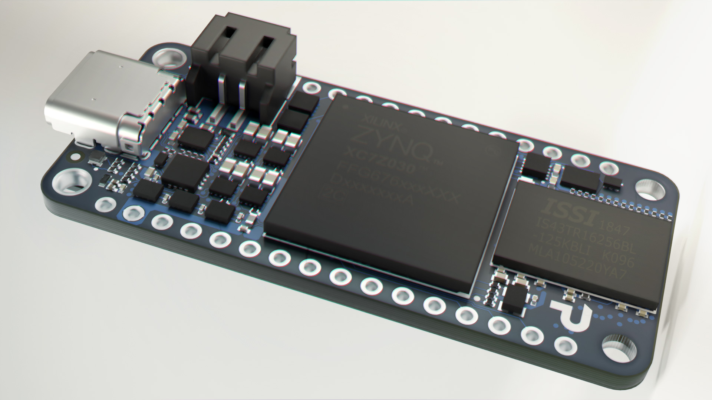

# Stylized PCB Shader Tutorial

This guide will walk you through creating a cool, stylized Printed Circuit Board (PCB) material in Blender. A key feature of this shader is that it's **light-independent**, meaning its glow and appearance are controlled directly within the material itself, not by the lights in your scene. It's perfect for motion graphics, abstract art, or technical illustrations.

We'll set it up so that all the main controls are grouped in an easy-to-find red frame. Let's begin! 💻

***

## 1. Initial Setup

First, get an object to work with (a plane or a cube will do fine).

1. Go to the **Shading** workspace.
2. Select your object and click **+ New** to create a new material.
3. Name it something like "Stylized_PCB".
4. By default, you'll have a `Principled BSDF` connected to the `Material Output`. **Delete the Principled BSDF**; we're starting from scratch.

***

## 2. Creating the Circuit Traces

We'll use a Voronoi texture to generate a pattern that looks like circuit traces.

1. Add a **Voronoi Texture** node (`Shift + A` > Search > `Voronoi Texture`).
2. Change the setting from `F1` to **Distance to Edge**. This creates a web-like pattern.
3. Add a **ColorRamp** node (`Shift + A` > Search > `ColorRamp`).
4. Connect the `Distance` output of the Voronoi Texture to the `Fac` input of the ColorRamp.
5. On the ColorRamp, slide the **black and white stops** very close to each other. This will create sharp, thin lines, which will be our traces. You can adjust the `Scale` on the Voronoi texture to change the density of the pattern.

Your node setup should look like this so far:

***

## 3. Making it Glow (Light-Independent Emission)

Now, let's make the material glow on its own.

1. Add an **Emission** shader (`Shift + A` > Search > `Emission`).
2. Connect the `Color` output of your `ColorRamp` to the `Color` input of the `Emission` shader.
3. Connect the `Emission` output to the `Surface` input of the `Material Output` node.

You should now see your circuit pattern glowing! The **Strength** value on the Emission node controls the overall brightness.

## 4. Customizing Colors and Controls

This is where we make the material easy to use. We'll add controls for the color and place them in a frame.

1. Add a **Mix RGB** node (`Shift + A` > Search > `Mix RGB`). Set its mode to **Mix**.
2. Disconnect the `ColorRamp` from the `Emission` shader. Instead, connect it to the **`Fac` (Factor)** input of the new `Mix RGB` node.
3. Connect the `Color` output of the `Mix RGB` node to the `Color` input of the `Emission` shader.
4. Now, **`Color1`** on the Mix RGB node controls the color of the board's base, and **`Color2`** controls the color of the traces. You can pick any colors you want—classic green, red, yellow, blue, etc.

## 5. The Control Frame

To keep things organized, let's group our main settings into a colored frame.

1. Select the key nodes you'll want to adjust later:
    * The **Voronoi Texture** (to change the pattern scale).
    * The **ColorRamp** (to change the trace thickness).
    * The **Mix RGB** node (to change the colors).
    * The **Emission** shader (to change the brightness).
2. With them selected, press **`Ctrl + J`** to create a frame around them.
3. Press `N` to open the side panel, go to the "Node" tab, and check the "Color" box. Pick a **red color** for your frame. You can also give it a label, like "PCB CONTROLS".

Your final, basic node tree will look like this:

`Voronoi Texture` -> `ColorRamp` -> (Fac) `Mix RGB` -> (Color) `Emission` -> `Material Output`

***

## Notes on Usage

* **Soldering Metals:** If you want to add realistic solder points that *do* react to light (like silver or gold), you would create a separate material using the **Principled BSDF** with `Metallic` set to `1.0` and your desired `Base Color`. You can then assign this second material to different faces on your mesh.
* **Donations:** This material is free for you to use and adapt. If you find it helpful, any donations are greatly appreciated!

Enjoy! 🎉

<https://3dcinetv.gumroad.com/l/solderingPCB>

<https://www.youtube.com/watch?v=7ratnf0rIVU>
